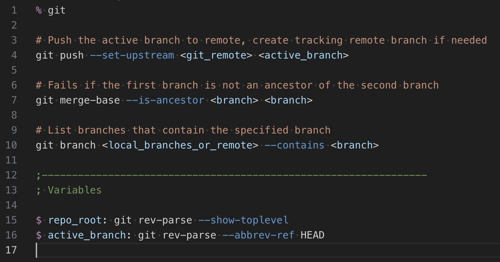

# Navi Cheatsheet Language Support for Visual Studio

Visual Studio syntax highlighting for [navi](https://github.com/denisidoro/navi)
[cheatsheet](https://github.com/denisidoro/navi/blob/master/docs/cheatsheet_syntax.md) files.

- Navi documentaion: https://github.com/denisidoro/navi
- Navi idea and development by @denisidoro
- Winged navi original logo design by @denisidoro